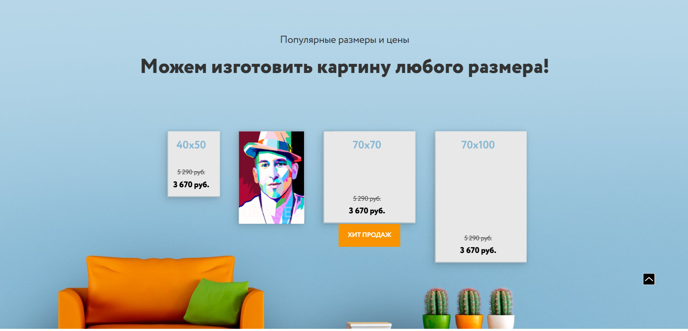

## Структура проекта

**Основные каталоги**

```
.
├── dist/
│   ├── assets/
│   │   ├── css/
│   │   ├── fonts/
│   │   ├── img/
│   │   ├── less/
│   │   ├── db.json
│   │   └── server.php
│   ├── index.html
│   └── script.js
├── src/
│   ├── assets/
│   │   ├── css/
│   │   ├── fonts/
│   │   ├── img/
│   │   ├── less/
│   │   ├── db.json
│   │   └── server.php
│   ├── js/
│   │   ├── modules/
│   │   ├── services/
│   │   └── main.js
│   ├── screenshots/
│   └── index.html
├── gulpfile.js
├── package.json
├── package-lock.json
└── README.md

```

=======





**О проекте**

Сайт магазина картин на Vanilla JavaScript + HTML + CSS. Пользователь может заказать картину, указав необходимые требования (габариты, материал холста и т.п.) Требования будут отправлены на сервер. На сайте реализованы слайдеры. Также пользователь может загрузить на сайт свой потрет (Drag & Drop) и отправить заявку на написание картины (данные с форм уходят на сервер).

**Технологии**

- Gulp
- Vanilla JavaScript
- webpack

**Установка**

```
git clone https://github.com/NikRNN/Picture.git
cd Picture
npm install
Разместить файлы на сервере/использовать Open Server для имитации сервера для отправки данных с форм.
```
